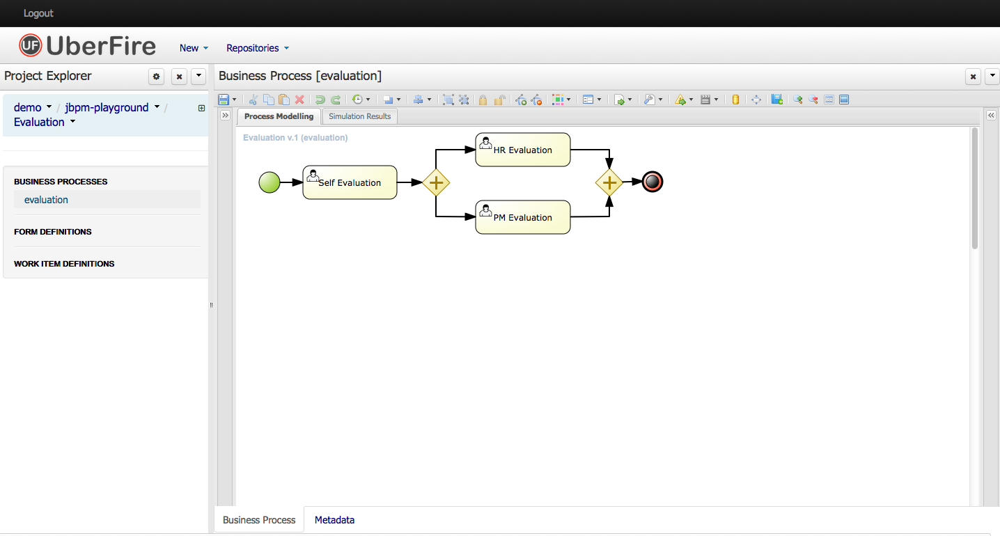

[[jBPMDesigner]]
= Designer
:imagesdir: .

Designer is a graphical web-based BPMN2 editor.
It allows users to model and simulate executable BPMN2 processes.
The main goal of Designe is to provide intuitive means to both technical and non-technical users to quickly create their executable business processes.
This chapter intends to describe all feature Designer offers currently.

.Designer

Designer targets the following business process modelling scenarios:

* View and/or edit existing BPMN2 processes: Designer allows you to open existing BPMN2 processes (for example created using the BPMN2 Eclipse editor or any other tooling that exports BPMN2 XML).
* Create fully executable BPMN2 processes: A user can create a new BPMN2 process in the Designer and use the editing capabilities (drag and drop and filling in properties in the properties panel) to fill in the details. This for example allows business users to create complete business processes all inside a a browser. The integration with Drools Guvnor allows for your business processes as wells as other business assets such as business rules, process forms/images, etc. to be stored and versioned inside a content  repository.
* View and/or edit Human Task forms during process modelling (using the in-line form editor or the Form Modeller).
* Simulate your business process models. Busines Process Simulation is based on the BPSIM 1.0 specification.

Designer supports all BPMN2 elements that are also supported by jBPM as well as all jBPM-specific BPMN2 extension elements and attributes.

include::Designer/UIExplained-section.adoc[leveloffset=+1]
include::Designer/Shapes-section.adoc[leveloffset=+1]
include::Designer/Toolbar-section.adoc[leveloffset=+1]
include::Designer/KeyboardShortcuts-section.adoc[leveloffset=+1]
include::Designer/Customization-section.adoc[leveloffset=+1]

