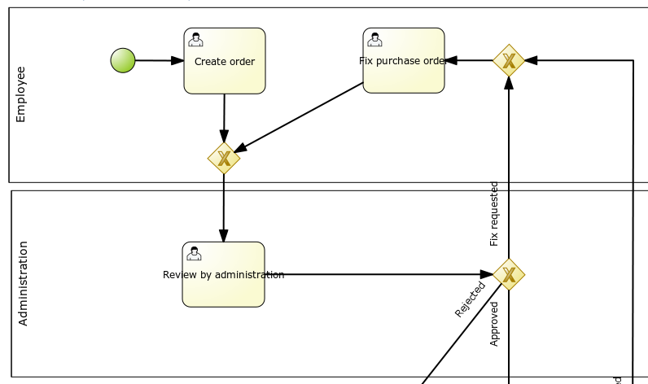
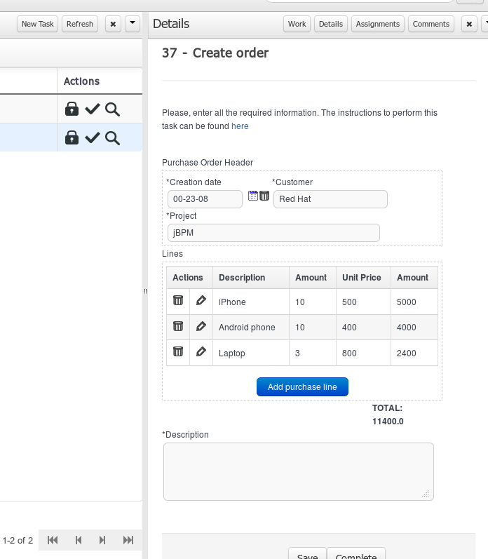

[[_chap_formmodeler]]
= Forms
:imagesdir: .

This chapter intends to describe in a simple ways all the steps required to create a process with human tasks, generate and modify the forms for these tasks and execute them.
It will provide initial guidance to perform all initial steps, but it will not provide a full description of all available features.

Given that forms are going to be used in tasks, it's possible to generate forms automatically from process variables and task definitions.
These forms can be later be modified by using the form editor.
In runtime, forms will receive data from process variables, display it to the user and capture his input, and then finally updating process variables again with the new values. 

The following example will show all the steps to follow to create a form for the 'Create order' task in the process below. 

.Process example

This form must look like the following in execution: 

.Process example

include::FormModeler/ConfigureProcess-section.adoc[leveloffset=+1]
include::FormModeler/GeneratingForms-section.adoc[leveloffset=+1]
include::FormModeler/EditForms-section.adoc[leveloffset=+1]
include::FormModeler/UploadingAttachments-section.adoc[leveloffset=+1]
include::FormModeler/UsingFormsClient-section.adoc[leveloffset=+1]

