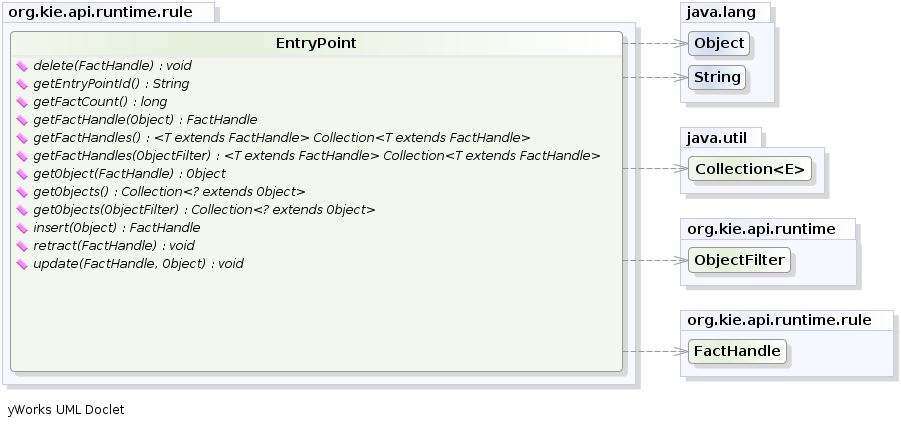
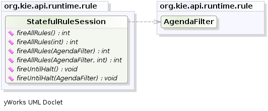
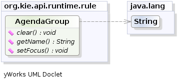
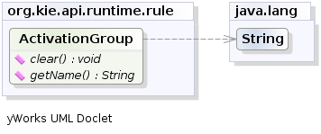
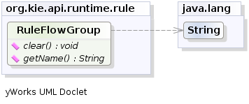
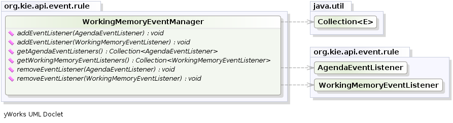
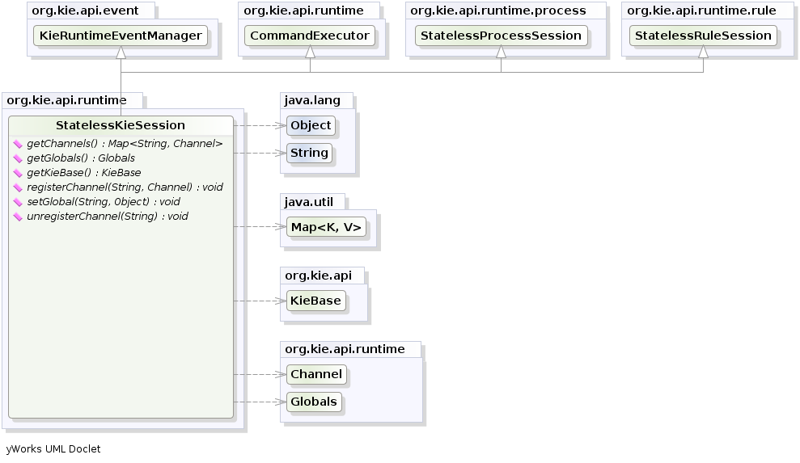

= Running
:imagesdir: .

Ths sections extends the KIE Running section, which should be read first, with specifics for the Drools runtime.

== KieRuntime

=== EntryPoint

The `EntryPoint` provides the methods around inserting, updating and deleting facts.
The term "entry point" is related to the fact that we have multiple partitions in a Working Memory and you can choose which one you are inserting into.
The use of multiple entry points is more common in event processing use cases, but they can be used by pure rule applications as well. 

The `KieRuntime` interface provides the main interaction with the engine.
It is available in rule consequences and process actions.
In this manual the focus is on the methods and interfaces related to rules, and the methods pertaining to processes will be ignored for now.
But you'll notice that the `KieRuntime` inherits methods from both the `WorkingMemory` and the ``ProcessRuntime``, thereby providing a unified API to work with processes and rules.
When working with rules, three interfaces form the ``KieRuntime``: ``EntryPoint``, `WorkingMemory` and the `KieRuntime` itself.

.EntryPoint

==== Insert

In order for a fact to be evaluated against the rules in a ``KieBase``, it has to be inserted into the session.
This is done by calling the method ``insert(yourObject)``.
When a fact is inserted into the session, some of its properties might be immediately evaluated (eager evaluation) and some might be deferred for later evaluation (lazy evaluation). The exact behaviour depends on the rules engine algorithm being used. 

[NOTE]
====
Expert systems typically use the term _assert_ or _assertion_ to refer to facts made available to the system.
However, due to "assert" being a keyword in most languages, we have decided to use the `insert` keyword; In this manual, the two terms are used interchangeably.
====

When an Object is inserted it returns a ``FactHandle``.
This `FactHandle` is the token used to represent your inserted object within the ``WorkingMemory``.
It is also used for interactions with the `WorkingMemory` when you wish to delete or modify an object.

[source,java]
----
Cheese stilton = new Cheese("stilton");
FactHandle stiltonHandle = ksession.insert( stilton );
----

As mentioned in the KieBase section, a Working Memory may operate in two assertion modes: either equality or identity.
Identity is the default.

_Identity_ means that the Working Memory uses an `IdentityHashMap` to store all asserted objects.
New instance assertions always result in the return of new ``FactHandle``, but if an instance is asserted again then it returns the original fact handle, i.e., it ignores repeated insertions for the same object.

_Equality_ means that the Working Memory uses a `HashMap` to store all asserted objects.
An object instance assertion will only return a new `FactHandle` if the inserted object is not equal (according to its `equal()/hashcode()` methods) to an already existing fact.

==== Delete

In order to remove a fact from the session, the method `delete()` is used.
When a fact is deleted,  any matches that are active and depend on that fact will be cancelled.
Note that it is possible to have rules that depend on the nonexistence of a fact, in which case deleting a fact may cause a rule to activate.
(See the `not` and `exists` keywords). 

[NOTE]
====
Expert systems typically use the term _retract_ or _retraction_ to refer to the operation of removing facts from the Working Memory.
Drools prefers the keyword `delete` for symmetry with the keyword ``insert``; Drools also supports the keyword ``retract``, but it was deprecated in favor of ``delete``.
In this manual, the two terms are used interchangeably.
====

Retraction may be done using the `FactHandle` that was returned by the insert call.
On the right hand side of a rule the `delete` statement is used, which works with a simple object reference.

[source,java]
----
Cheese stilton = new Cheese("stilton");
FactHandle stiltonHandle = ksession.insert( stilton );
....
ksession.delete( stiltonHandle );
----

==== Update

The Rule Engine must be notified of modified facts, so that they can be reprocessed.
You must use the `update()` method to notify the `WorkingMemory` of changed objects for those objects that are not able to notify the `WorkingMemory` themselves.
Notice that `update()` always takes the modified object as a second parameter, which allows you to specify new instances for immutable objects.
On the right hand side of a rule the `modify` statement is recommended, as it makes the changes and notifies the engine in a single statement.
Alternatively, after changing a fact object's field values through calls of setter methods you must invoke `update` immediately, event before changing another fact, or you will cause problems with the indexing within the rule engine.
The modify statement avoids this problem.

[source,java]
----
Cheese stilton = new Cheese("stilton");
FactHandle stiltonHandle = workingMemory.insert( stilton );
...
stilton.setPrice( 100 );
workingMemory.update( stiltonHandle, stilton );
----

=== RuleRuntime

The RuleRuntime provides access to the Agenda, permits query executions, and lets you access named Entry Points.

.RuleRuntime
image::UserGuide/RuleRuntime.png[align="center"]

==== Query

Queries are used to retrieve fact sets based on patterns, as they are used in rules.
Patterns may make use of optional parameters.
Queries can be defined in the Knowledge Base, from where they are called up to return the matching results.
While iterating over the result collection, any identifier bound in the query can be used to access the corresponding fact or fact field by calling the `get` method with the binding variable's name as its argument.
If the binding refers to a fact object, its FactHandle can be retrieved by calling ``getFactHandle``, again with the variable's name as the parameter.

.QueryResults
image::UserGuide/QueryResults.png[align="center"]

.QueryResultsRow
image::UserGuide/QueryResultsRow.png[align="center"]

.Simple Query Example
====
[source,java]
----
QueryResults results =
    ksession.getQueryResults( "my query", new Object[] { "string" } );
for ( QueryResultsRow row : results ) {
    System.out.println( row.get( "varName" ) );
}
----
====

==== Live Queries

Invoking queries and processing the results by iterating over the returned set is not a good way to monitor changes over time.

To alleviate this, Drools provides Live Queries, which have a listener attached instead of returning an iterable result set.
These live queries stay open by creating a view and publishing change events for the contents of this view.
To activate, you start your query with parameters and listen to changes in the resulting view.
The `dispose` method terminates the query and discontinues this reactive scenario.

.Implementing ViewChangedEventListener
====
[source,java]
----
final List updated = new ArrayList();
final List removed = new ArrayList();
final List added = new ArrayList();

ViewChangedEventListener listener = new ViewChangedEventListener() {
 public void rowUpdated(Row row) {
  updated.add( row.get( "$price" ) );
 }

 public void rowRemoved(Row row) {
  removed.add( row.get( "$price" ) );
 }

 public void rowAdded(Row row) {
  added.add( row.get( "$price" ) );
 }
};

// Open the LiveQuery
LiveQuery query = ksession.openLiveQuery( "cheeses",
                                          new Object[] { "cheddar", "stilton" },
                                          listener );
...
...
query.dispose() // calling dispose to terminate the live query
----
====

A Drools blog article contains an example of Glazed Lists integration for live queries:

http://blog.athico.com/2010/07/glazed-lists-examples-for-drools-live.html

=== StatefulRuleSession

The `StatefulRuleSession` is inherited by the `KieSession` and provides the rule related methods that are relevant from outside of the engine.

.StatefulRuleSession

==== Agenda Filters

.AgendaFilters
image::UserGuide/AgendaFilter.png[align="center"]

`
AgendaFilter` objects are optional implementations of the filter interface which are used to allow or deny the firing of a match.
What you filter on is entirely up to the implementation.
Drools 4.0 used to supply some out of the box filters, which have not be exposed in drools 5.0 knowledge-api, but they are simple to implement and the Drools 4.0 code base can be referred to.

To use a filter specify it while calling ``fireAllRules()``.
The following example permits only rules ending in the string ``"Test"``.
All others will be filtered out.

[source,java]
----
ksession.fireAllRules( new RuleNameEndsWithAgendaFilter( "Test" ) );
----

== Agenda

The Agenda is a _Rete_ feature.
During actions on the ``WorkingMemory``, rules may become fully matched and eligible for execution; a single Working Memory Action can result in multiple eligible rules.
When a rule is fully matched a Match is created, referencing the rule and the matched facts, and placed onto the Agenda.
The Agenda controls the execution order of these Matches using a Conflict Resolution strategy.

The engine cycles repeatedly through two phases:

. Working Memory Actions. This is where most of the work takes place, either in the Consequence (the RHS itself) or the main Java application process. Once the Consequence has finished or the main Java application process calls `fireAllRules()` the engine switches to the Agenda Evaluation phase.
. Agenda Evaluation. This attempts to select a rule to fire. If no rule is found it exits, otherwise it fires the found rule, switching the phase back to Working Memory Actions.

.Two Phase Execution
image::HybridReasoning/Two_Phase.png[align="center"]

The process repeats until the agenda is clear, in which case control returns to the calling application.
When Working Memory Actions are taking place, no rules are being fired.

.Agenda
image::UserGuide/Agenda.png[align="center"]

=== Conflict Resolution

Conflict resolution is required when there are multiple rules on the agenda.
(The basics to this are covered in chapter "Quick Start".) As firing a rule may have side effects on the working memory, the rule engine needs to know in what order the rules should fire (for instance, firing ruleA may cause ruleB to be removed from the agenda).

The default conflict resolution strategies employed by Drools are: Salience and LIFO (last in, first out).

The most visible one is _salience_ (or priority), in which case a user can specify that a certain rule has a higher priority (by giving it a higher number) than other rules.
In that case, the rule with higher salience will be preferred.
LIFO priorities are based on the assigned Working Memory Action counter value, with all rules created during the same action receiving the same value.
The execution order of a set of firings with the same priority value is arbitrary.

As a general rule, it is a good idea not to count on rules firing in any particular order, and to author the rules without worrying about a "flow". However when a flow is needed a number of possibilities exist, including but not limited to: agenda groups, rule flow groups, activation groups, control/semaphore facts.
These are discussed in later sections.

Drools 4.0 supported custom conflict resolution strategies; while this capability still exists in Drools it has not yet been exposed to the end user via knowledge-api in Drools 5.0.

=== AgendaGroup

.AgendaGroup

Agenda groups are a way to partition rules (matches, actually) on the agenda.
At any one time, only one group has "focus" which means that matches for rules in that group only will take effect.
You can also have rules with "auto focus" which means that the focus is taken for its agenda group when that rule's conditions are true.

Agenda groups are known as "modules" in CLIPS terminology.
While it best to design rules that do not need control flow, this is not always possible.
Agenda groups provide a handy way to create a "flow" between grouped rules.
You can switch the group which has focus either from within the rule engine, or via the API.
If your rules have a clear need for multiple "phases" or "sequences" of processing, consider using agenda-groups for this purpose.

Each time `setFocus()` is called it pushes that Agenda Group onto a stack.
When the focus group is empty it is popped from the stack and the focus group that is now on top evaluates.
An Agenda Group can appear in multiple locations on the stack.
The default Agenda Group is "MAIN", with all rules which do not specify an Agenda Group being in this group.
It is also always the first group on the stack, given focus initially, by default.

[source,java]
----
ksession.getAgenda().getAgendaGroup( "Group A" ).setFocus();
----

The `clear()` method can be used to cancel all the activations generated by the rules belonging to a given Agenda Group before one has had a chance to fire.

[source,java]
----
ksession.getAgenda().getAgendaGroup( "Group A" ).clear();
----

Note that, due to the lazy nature of the phreak algorithm used by Drools, the activations are by default materialized only at firing time, but it is possible to anticipate the evaluation and then the activation of a given rule at the moment when a fact is inserted into the session by annotating it with `@Propagation(IMMEDIATE)` as explained in the Propagation modes section.

=== ActivationGroup

.ActivationGroup

An activation group is a set of rules bound together by the same "activation-group" rule attribute.
In this group only one rule can fire, and after that rule has fired all the other rules are cancelled from the agenda.
The `clear()` method can be called at any time, which cancels all of the activations before one has had a chance to fire.

[source,java]
----
ksession.getAgenda().getActivationGroup( "Group B" ).clear();
----

=== RuleFlowGroup

.RuleFlowGroup

A rule flow group is a group of rules associated by the "ruleflow-group" rule attribute.
These rules can only fire when the group is activated.
The group itself can only become active when the elaboration of the ruleflow diagram reaches the node representing the group.
Here too, the `clear()` method can be called at any time to cancels all matches still remaining on the Agenda.

[source,java]
----
ksession.getAgenda().getRuleFlowGroup( "Group C" ).clear();
----

== Event Model

The event package provides means to be notified of rule engine events, including rules firing, objects being asserted, etc.
This allows you, for instance, to separate logging and auditing activities from the main part of your application (and the rules).

The `WorkingMemoryEventManager` allows for listeners to be added and removed, so that events for the working memory and the agenda can be listened to.

.WorkingMemoryEventManager

The following code snippet shows how a simple agenda listener is declared and attached to a session.
It will print matches after they have fired.

.Adding an AgendaEventListener
====
[source,java]
----
ksession.addEventListener( new DefaultAgendaEventListener() {
   public void afterMatchFired(AfterMatchFiredEvent event) {
       super.afterMatchFired( event );
       System.out.println( event );
   }
});
----
====

Drools also provides `DebugRuleRuntimeEventListener` and `DebugAgendaEventListener` which implement each method with a debug print statement.
To print all Working Memory events, you add a listener like this:

.Adding a DebugRuleRuntimeEventListener
====
[source,java]
----
ksession.addEventListener( new DebugRuleRuntimeEventListener() );
----
====

The events currently supported are:

* MatchCreatedEvent
* MatchCancelledEvent
* BeforeMatchFiredEvent
* AfterMatchFiredEvent
* AgendaGroupPushedEvent
* AgendaGroupPoppedEvent
* ObjectInsertEvent
* ObjectDeletedEvent
* ObjectUpdatedEvent
* ProcessCompletedEvent
* ProcessNodeLeftEvent
* ProcessNodeTriggeredEvent
* ProcessStartEvent

== StatelessKieSession

The `StatelessKieSession` wraps the ``KieSession``, instead of extending it.
Its main focus is on decision service type scenarios.
It avoids the need to call ``dispose()``.
Stateless sessions do not support iterative insertions and the method call `fireAllRules()` from Java code; the act of calling `execute()` is a single-shot method that will internally instantiate a ``KieSession``, add all the user data and execute user commands, call ``fireAllRules()``, and then call ``dispose()``.
While the main way to work with this class is via the `BatchExecution` (a subinterface of ``Command``) as supported by the `CommandExecutor` interface, two convenience methods are provided for when simple object insertion is all that's required.
The `CommandExecutor` and `BatchExecution` are talked about in detail in their own section.

.StatelessKieSession

Our simple example shows a stateless session executing a given collection of Java objects using the convenience API.
It will iterate the collection, inserting each element in turn.

.Simple StatelessKieSession execution with a Collection
====
[source,java]
----
StatelessKieSession ksession = kbase.newStatelessKieSession();
ksession.execute( collection );
----
====

If this was done as a single Command it would be as follows:

.Simple StatelessKieSession execution with InsertElements Command
====
[source,java]
----
ksession.execute( CommandFactory.newInsertElements( collection ) );
----
====

If you wanted to insert the collection itself, and the collection's individual elements, then `CommandFactory.newInsert(collection)` would do the job.

Methods of the `CommandFactory` create the supported commands, all of which can be marshalled using XStream and the ``BatchExecutionHelper``. `BatchExecutionHelper` provides details on the XML format as well as how to use Drools Pipeline to automate the marshalling of `BatchExecution` and ``ExecutionResults``.

`StatelessKieSession` supports globals, scoped in a number of ways.
I'll cover the non-command way first, as commands are scoped to a specific execution call.
Globals can be resolved in three ways.

* The StatelessKieSession method `getGlobals()` returns a Globals instance which provides access to the session's globals. These are shared for _all_ execution calls. Exercise caution regarding mutable globals because execution calls can be executing simultaneously in different threads.
+

.Session scoped global
====
[source,java]
----
StatelessKieSession ksession = kbase.newStatelessKieSession();
// Set a global hbnSession, that can be used for DB interactions in the rules.
ksession.setGlobal( "hbnSession", hibernateSession );
// Execute while being able to resolve the "hbnSession" identifier.
ksession.execute( collection );
----
====
* Using a delegate is another way of global resolution. Assigning a value to a global (with ``setGlobal(String, Object)``) results in the value being stored in an internal collection mapping identifiers to values. Identifiers in this internal collection will have priority over any supplied delegate. Only if an identifier cannot be found in this internal collection, the delegate global (if any) will be used.
* The third way of resolving globals is to have execution scoped globals. Here, a `Command` to set a global is passed to the ``CommandExecutor``.

The `CommandExecutor` interface also offers the ability to export data via "out" parameters.
Inserted facts, globals and query results can all be returned.

.Out identifiers
====
[source,java]
----
// Set up a list of commands
List cmds = new ArrayList();
cmds.add( CommandFactory.newSetGlobal( "list1", new ArrayList(), true ) );
cmds.add( CommandFactory.newInsert( new Person( "jon", 102 ), "person" ) );
cmds.add( CommandFactory.newQuery( "Get People" "getPeople" );

// Execute the list
ExecutionResults results =
  ksession.execute( CommandFactory.newBatchExecution( cmds ) );

// Retrieve the ArrayList
results.getValue( "list1" );
// Retrieve the inserted Person fact
results.getValue( "person" );
// Retrieve the query as a QueryResults instance.
results.getValue( "Get People" );
----
====

=== Sequential Mode

With Rete you have a stateful session where objects can be asserted and modified over time, and where rules can also be added and removed.
Now what happens if we assume a stateless session, where after the initial data set no more data can be asserted or modified and rules cannot be added or removed? Certainly it won't be necessary to re-evaluate rules, and the engine will be able to operate in a simplified way.

. Order the Rules by salience and position in the ruleset (by setting a sequence attribute on the rule terminal node).
. Create an elements, one element for each possible rule match; element position indicates firing order.
. Turn off all node memories, except the right-input Object memory.
. Disconnect the Left Input Adapter Node propagation, and let the Object plus the Node be referenced in a Command object, which is added to a list on the Working Memory for later execution.
. Assert all objects, and, when all assertions are finished and thus right-input node memories are populated, check the Command list and execute each in turn.
. All resulting Matches should be placed in the elements, based upon the determined sequence number of the Rule. Record the first and last populated elements, to reduce the iteration range.
. Iterate the elements of Matches, executing populated element in turn.
. If we have a maximum number of allowed rule executions, we can exit our network evaluations early to fire all the rules in the elements.

The `LeftInputAdapterNode` no longer creates a Tuple, adding the Object, and then propagate the Tuple – instead a Command object is created and added to a list in the Working Memory.
This Command object holds a reference to the `LeftInputAdapterNode` and the propagated object.
This stops any left-input propagations at insertion time, so that we know that a right-input propagation will never need to attempt a join with the left-inputs (removing the need for left-input memory). All nodes have their memory turned off, including the left-input Tuple memory but excluding the right-input object memory, which means that the only node remembering an insertion propagation is the right-input object memory.
Once all the assertions are finished and all right-input memories populated, we can then iterate the list of `LeftInputAdatperNode` Command objects calling each in turn.
They will propagate down the network attempting to join with the right-input objects, but they won't be remembered in the left input as we know there will be no further object assertions and thus propagations into the right-input memory.

There is no longer an Agenda, with a priority queue to schedule the Tuples; instead, there is simply an elements for the number of rules.
The sequence number of the `RuleTerminalNode` indicates the element within the elements where to place the Match.
Once all Command objects have finished we can iterate our elements, checking each element in turn, and firing the Matches if they exist.
To improve performance, we remember the first and the last populated cell in the elements.
The network is constructed, with each `RuleTerminalNode` being given a sequence number based on a salience number and its order of being added to the network.

Typically the right-input node memories are Hash Maps, for fast object deletion; here, as we know there will be no object deletions, we can use a list when the values of the object are not indexed.
For larger numbers of objects indexed Hash Maps provide a performance increase; if we know an object type has only a few instances, indexing is probably not advantageous, and a list can be used.

Sequential mode can only be used with a Stateless Session and is off by default.
To turn it on, either call ``RuleBaseConfiguration.setSequential(true)``, or set the rulebase configuration property `drools.sequential` to true.
Sequential mode can fall back to a dynamic agenda by calling `setSequentialAgenda` with ``SequentialAgenda.DYNAMIC``.
You may also set the "drools.sequential.agenda" property to "sequential" or "dynamic".

== Rule Execution Modes

Drools provides two modes for rule execution - passive and active.

As a general guideline, Passive Mode is most suitable for Rule Engine applications which need to explicitly control when the engine shall evaluate and fire the rules, or for CEP applications making use of the Pseudo Clock. Active Mode is most effective for Rule Engine applications which delegate control of when rules are evaluated and fired to the engine, or for typical CEP application making use of the Real Time Clock.

=== Passive Mode

With Passive mode not only is the user responsible for working memory operations, such as `insert()`, but also for when the rules are to evaluate the data and fire the resulting rule instantiations - using `fireAllRules()`  .

An example outline of Drools code for a CEP application making use of Passive Mode:
[source,java]
----
KieSessionConfiguration config = KieServices.Factory.get().newKieSessionConfiguration();
config.setOption( ClockTypeOption.get("pseudo") );
KieSession session = kbase.newKieSession( conf, null );
SessionPseudoClock clock = session.getSessionClock();

session.insert( tick1 );
session.fireAllRules();

clock.advanceTime(1, TimeUnit.SECONDS);
session.insert( tick2 );
session.fireAllRules();

clock.advanceTime(1, TimeUnit.SECONDS);
session.insert( tick3 );
session.fireAllRules();

session.dispose();
----

=== Active Mode

Drools offers a `fireUntilHalt()` method, that starts the engine in Active Mode, which is asynchronous in behavior, where rules will be continually evaluated and fired, until a `halt()` call is made.

This is specially useful for CEP scenarios that require what is commonly known as "active queries".

Please note calling `fireUntilHalt()` blocks the current thread, while the engine will start and continue running asynchronously until the `halt()` is called on the KieSession. It is suggested therefore to call `fireUntilHalt()` from a dedicated thread, so the current thread does not get blocked indefinitely; this also enable the current thread to call `halt()` at a later stage, ref. examples below.

An example outline of Drools code for a CEP application making use of Active Mode:
[source,java]
----
KieSessionConfiguration config = KieServices.Factory.get().newKieSessionConfiguration();
config.setOption( ClockTypeOption.get("realtime") );
KieSession session = kbase.newKieSession( conf, null );

new Thread( new Runnable() {
  @Override
  public void run() {
      session.fireUntilHalt();
  }
} ).start();

session.insert( tick1 );

... Thread.sleep( 1000L ); ...

session.insert( tick2 );

... Thread.sleep( 1000L ); ...

session.insert( tick3 );

session.halt();
session.dispose();
----

NOTE: Generally, it is not recommended mixing `fireAllRules()` and `fireUntilHalt()`, especially from different threads. However the engine is able to handle such situations safely, thanks to the internal state machine. If `fireAllRules()` is running and a call `fireUntilHalt()` is made, the engine will wait until the `fireAllRules()` is finished and then start `fireUntilHalt()`. However if `fireUntilHalt()` is running and `fireAllRules()` is called, the later is ignored and will just return directly. For more details about thread-safety and the internal state machine, reference section "Improved multi-threading behaviour".

==== Performing KieSession operations atomically when in Active Mode

When in Active Mode, the Drools engine is in control of when the rule shall be evaluated and fired; therefore it is important that operations on the KieSession are performed in a thread-safe manner. Additionally, from a client-side perspective, there might be the need for more than one operations to be called on the KieSession in between rule evaluations, but for engine to consider these as an atomic operation: for example, inserting more than one Fact at a given time, but for the engine to await until all the inserts are done, before evaluating the rules again.

Drools offers a `submit()` method to group and perform operations on the KieSession as a thread-safe atomic action, while in Active Mode.

An example outline of Drools code to perform KieSession operations atomically when in Active Mode:
[source,java]
----
KieSession session = ...;

new Thread( new Runnable() {
  @Override
  public void run() {
      session.fireUntilHalt();
  }
} ).start();

final FactHandle fh = session.insert( fact_a );

... Thread.sleep( 1000L ); ...

session.submit( new KieSession.AtomicAction() {
  @Override
  public void execute( KieSession kieSession ) {
    fact_a.setField("value");
    kieSession.update( fh, fact_a );
    kieSession.insert( fact_1 );
    kieSession.insert( fact_2 );
    kieSession.insert( fact_3 );
  }
} );

... Thread.sleep( 1000L ); ...

session.insert( fact_z );

session.halt();
session.dispose();
----

As a reminder example, the fact handle could also be retrieved from the KieSession:
[source,java]
----
...
session.insert( fact_a );

... Thread.sleep( 1000L ); ...

session.submit( new KieSession.AtomicAction() {
  @Override
  public void execute( KieSession kieSession ) {
    final FactHandle fh = kieSession.getFactHandle( fact_a );
    fact_a.setField("value");
    kieSession.update( fh, fact_a );
    kieSession.insert( fact_1 );
    kieSession.insert( fact_2 );
    kieSession.insert( fact_3 );
  }
} );

...
----

== Propagation modes

The introduction of PHREAK as default algorithm for the Drools engine made the rules' evaluation lazy.
This new Drools lazy behavior allowed a relevant performance boost but, in some very specific cases, breaks the semantic of a few Drools features.

More precisely in some circumstances it is necessary to propagate the insertion of new fact into th session immediately.
For instance Drools allows a query to be executed in pull only (or passive) mode by prepending a '?' symbol to its invocation as in the following example:

.A passive query
====
[source,java]
----
query Q (Integer i)
    String( this == i.toString() )
end
rule R when
    $i : Integer()
    ?Q( $i; )
then
    System.out.println( $i );
end
----
====

In this case, since the query is passive, it shouldn't react to the insertion of a String matching the join condition in the query itself.
In other words this sequence of commands

[source,java]
----
KieSession ksession = ...
ksession.insert(1);
ksession.insert("1");
ksession.fireAllRules();
----

shouldn't cause the rule R to fire because the String satisfying the query condition has been inserted after the Integer and the passive query shouldn't react to this insertion.
Conversely the rule should fire if the insertion sequence is inverted because the insertion of the Integer, when the passive query can be satisfied by the presence of an already existing String, will trigger it.

Unfortunately the lazy nature of PHREAK doesn't allow the engine to make any distinction regarding the insertion sequence of the two facts, so the rule will fire in both cases.
In circumstances like this it is necessary to evaluate the rule eagerly as done by the old RETEOO-based engine.

In other cases it is required that the propagation is eager, meaning that it is not immedate, but anyway has to happen before the engine/agenda starts scheduled evaluations.
For instance this is necessary when a rule has the no-loop or the lock-on-active attribute and in fact when this happens this propagation mode is automatically enforced by the engine.

To cover these use cases, and in all other situations where an immediate or eager rule evaluation is required, it is possible to declaratively specify so by annotating the rule itself with **@Propagation(Propagation.Type)**, where Propagation.Type is an enumeration with 3 possible values:

* *IMMEDIATE* means that the propagation is performed immediately.
* *EAGER* means that the propagation is performed lazily but eagerly evaluated before scheduled evaluations.
* *LAZY* means that the propagation is totally lazy and this is default PHREAK behaviour

This means that the following drl:

.A data-driven rule using a passive query
====
[source,java]
----
query Q (Integer i)
    String( this == i.toString() )
end
rule R @Propagation(IMMEDIATE) when
    $i : Integer()
    ?Q( $i; )
then
    System.out.println( $i );
end
----
====

will make the rule R to fire if and only if the Integer is inserted after the String, thus behaving in accordance with the semantic of the passive query.

== Commands and the CommandExecutor

The `CommandFactory` allows for commands to be executed on those sessions, the only difference being that the Stateless Knowledge Session executes `fireAllRules()` at the end before disposing the session.
The currently supported commands are:

* FireAllRules
* GetGlobal
* SetGlobal
* InsertObject
* InsertElements
* Query
* StartProcess
* BatchExecution

`
InsertObject` will insert a single object, with an optional "out" identifier. `InsertElements` will iterate an Iterable, inserting each of the elements.
What this means is that a Stateless Knowledge Session is no longer limited to just inserting objects, it can now start processes or execute queries, and do this in any order.

.Insert Command
====
[source,java]
----
StatelessKieSession ksession = kbase.newStatelessKieSession();
ExecutionResults bresults =
  ksession.execute( CommandFactory.newInsert( new Cheese( "stilton" ), "stilton_id" ) );
Stilton stilton = bresults.getValue( "stilton_id" );
----
====

The execute method always returns an `ExecutionResults` instance, which allows access to any command results if they specify an out identifier such as the "stilton_id" above.

.InsertElements Command
====
[source,java]
----
StatelessKieSession ksession = kbase.newStatelessKieSession();
Command cmd = CommandFactory.newInsertElements( Arrays.asList( Object[] {
                  new Cheese( "stilton" ),
                  new Cheese( "brie" ),
                  new Cheese( "cheddar" ),
              });
ExecutionResults bresults = ksession.execute( cmd );
----
====

The execute method only allows for a single command.
That's where `BatchExecution` comes in, which represents a composite command, created from a list of commands.
Now, execute will iterate over the list and execute each command in turn.
This means you can insert some objects, start a process, call fireAllRules and execute a query, all in a single `execute(...)` call, which is quite powerful.

As mentioned previosly, the StatelessKieSession will execute `fireAllRules()` automatically at the end.
However the keen-eyed reader probably has already noticed the `FireAllRules` command and wondered how that works with a StatelessKieSession.
The `FireAllRules` command is allowed, and using it will disable the automatic execution at the end; think of using it as a sort of manual override function.

A custom XStream marshaller can be used with the Drools Pipeline to achieve XML scripting, which is perfect for services.
Here are two simple XML samples, one for the BatchExecution and one for the ``ExecutionResults``.

.Simple BatchExecution XML
====
[source,xml]
----
<batch-execution>
   <insert out-identifier='outStilton'>
      <org.drools.compiler.Cheese>
         <type>stilton</type>
         <price>25</price>
         <oldPrice>0</oldPrice>
      </org.drools.compiler.Cheese>
   </insert>
</batch-execution>
----
====

.Simple ExecutionResults XML
====
[source,xml]
----
<execution-results>
   <result identifier='outStilton'>
      <org.drools.compiler.Cheese>
         <type>stilton</type>
         <oldPrice>25</oldPrice>
         <price>30</price>
      </org.drools.compiler.Cheese>
   </result>
</execution-results>
----
====

Spring and Camel, covered in the integrations book, facilitate declarative services.

.BatchExecution Marshalled to XML
====
[source,xml]
----
<batch-execution>
  <insert out-identifier="stilton">
    <org.drools.compiler.Cheese>
      <type>stilton</type>
      <price>1</price>
      <oldPrice>0</oldPrice>
    </org.drools.compiler.Cheese>
  </insert>
  <query out-identifier='cheeses2' name='cheesesWithParams'>
    <string>stilton</string>
    <string>cheddar</string>
  </query>
</batch-execution>
----
====

The `CommandExecutor` returns an ``ExecutionResults``, and this is handled by the pipeline code snippet as well.
A similar output for the <batch-execution> XML sample above would be:

.ExecutionResults Marshalled to XML
====
[source,xml]
----
<execution-results>
  <result identifier="stilton">
    <org.drools.compiler.Cheese>
      <type>stilton</type>
      <price>2</price>
    </org.drools.compiler.Cheese>
  </result>
  <result identifier='cheeses2'>
    <query-results>
      <identifiers>
        <identifier>cheese</identifier>
      </identifiers>
      <row>
        <org.drools.compiler.Cheese>
          <type>cheddar</type>
          <price>2</price>
          <oldPrice>0</oldPrice>
        </org.drools.compiler.Cheese>
      </row>
      <row>
        <org.drools.compiler.Cheese>
          <type>cheddar</type>
          <price>1</price>
          <oldPrice>0</oldPrice>
        </org.drools.compiler.Cheese>
      </row>
    </query-results>
  </result>
</execution-results>
----
====

The `BatchExecutionHelper` provides a configured XStream instance to support the marshalling of Batch Executions, where the resulting XML can be used as a message format, as shown above.
Configured converters only exist for the commands supported via the Command Factory.
The user may add other converters for their user objects.
This is very useful for scripting stateless or stateful knowledge sessions, especially when services are involved.

There is currently no XML schema to support schema validation.
The basic format is outlined here, and the drools-pipeline module has an illustrative unit test in the `XStreamBatchExecutionTest` unit test.
The root element is <batch-execution> and it can contain zero or more commands elements.

.Root XML element
====
[source,xml]
----
<batch-execution>
...
</batch-execution>
----
====

This contains a list of elements that represent commands, the supported commands is limited to those Commands provided by the Command Factory.
The most basic of these is the <insert> element, which inserts objects.
The contents of the insert element is the user object, as dictated by XStream.

.Insert
====
[source,xml]
----
<batch-execution>
   <insert>
      ...<!-- any user object -->
   </insert>
</batch-execution>
----
====

The insert element features an "out-identifier" attribute, demanding that the inserted object will also be returned as part of the result payload.

.Insert with Out Identifier Command
====
[source,xml]
----
<batch-execution>
   <insert out-identifier='userVar'>
      ...
   </insert>
</batch-execution>
----
====

It's also possible to insert a collection of objects using the <insert-elements> element.
This command does not support an out-identifier.
The `org.domain.UserClass` is just an illustrative user object that XStream would serialize.

.Insert Elements command
====
[source,xml]
----
<batch-execution>
   <insert-elements>
      <org.domain.UserClass>
         ...
      </org.domain.UserClass>
      <org.domain.UserClass>
         ...
      </org.domain.UserClass>
      <org.domain.UserClass>
         ...
      </org.domain.UserClass>
   </insert-elements>
</batch-execution>
----
====

While the `out` attribute is useful in returning specific instances as a result payload, we often wish to run actual queries.
Both parameter and parameterless queries are supported.
The `name` attribute is the name of the query to be called, and the `out-identifier` is the identifier to be used for the query results in the `<execution-results>` payload.

.Query Command
====
[source,xml]
----
<batch-execution>
   <query out-identifier='cheeses' name='cheeses'/>
   <query out-identifier='cheeses2' name='cheesesWithParams'>
      <string>stilton</string>
      <string>cheddar</string>
   </query>
</batch-execution>
----
====
