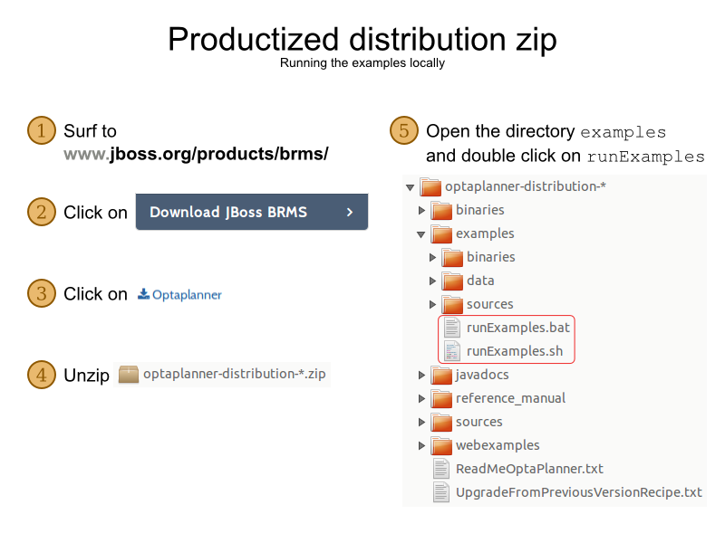

[id='_productintroduction']
= {PLANNER} Introduction

[id='_productintroductionoverview']
== What is {PLANNER}

_{PLANNER}_ is a lightweight, embeddable planning engine that optimizes planning problems.
It helps normal Java(TM) programmers solve planning problems efficiently, and it combines optimization heuristics and metaheuristics with very efficient score calculations.

{PLANNER} helps solve various use cases like the following:

* _Employee/Patient Rosters_. It helps create timetables for nurses and keeps track of patient bed management.
* _Educational Timetables_. It helps schedule lessons, courses, exams, and conference presentations.
* _Shop Schedules_: It tracks car assembly lines, machine queue planning, and workforce task planning.
* _Cutting Stock_: It minimizes waste by reducing the consumption of resources such as paper and steel.

Every organization faces planning problems; that is, they provide products and services with a limited set of constrained resources (employees, assets, time, and money).

.Use Case Overview
image::PlannerIntroduction/WhatIsOptaPlanner/useCaseOverview.png[]

{PLANNER} is open source software under the Apache Software License 2.0.
It is 100% pure Java(TM) and runs on any Java virtual machine.

[id='runTheExamplesInAnIDE']
== Download {PLANNER}

{PLANNER} is production ready.
The API is stable but backward incompatible changes can occur.
With the recipe called https://www.optaplanner.org/download/upgradeRecipe/[UpgradeFromPreviousVersionRecipe.txt], you can easily upgrade to a newer version and quickly deal with any backwards incompatible changes.
This recipe file is included in every release.

.Procedure: Get the release ZIP and run the examples
. Navigate to the https://access.redhat.com[Red Hat Customer Portal] and log in with your user credentials.
. Select *Downloads* -> *Red Hat JBoss Middleware* -> *Download Software*.
. From the *Products* drop-down menu, select *BPM Suite* or *BRMS Platform*.
. From the *Version* drop-down menu, select the product version *{PRODUCT_VERSION}*.
. Select the *Standalone* or *Deployable* file and then click *download*.
. Unzip the files.
. Open the directory `examples` and run the following script:
+
Linux or Mac:
+

[source]
----
$ cd examples
$ ./runExamples.sh
----
+
Windows:
+

[source]
----
$ cd examples
$ runExamples.bat
----

.Download {PLANNER}

The Examples GUI application will open.
Just pick an example:

image::PlannerIntroduction/DownloadAndRunTheExamples/plannerExamplesAppScreenshot.png[]

[NOTE]
====
{PLANNER} itself has no GUI dependencies.
It runs just as well on a server or a mobile JVM as it does on the desktop.
====

[id='_productintroductionexamples']
== Run the Examples

.Procedure: To run the examples in your favorite IDE:
. Configure your IDE:
* In IntelliJ and NetBeans, just open the file `examples/sources/pom.xml` as a new project, the Maven integration will take care of the rest.
* In Eclipse, open a new project for the directory `examples/sources`.

* Add all the JARs to the classpath from the directory `binaries` and the directory `examples/binaries` , except for the file `examples/binaries/optaplanner-examples-*.jar`.
* Add the Java source directory `src/main/java` and the Java resources directory `src/main/resources`.
. Next, create a run configuration:
* Main class: `org.optaplanner.examples.app.OptaPlannerExamplesApp`
* VM parameters (optional): `-Xmx512M -server`
* Working directory: `examples` (this is the directory that contains the directory ``data``)
. Run that run configuration.

.Procedure: Use {PLANNER} with Maven, Gradle, Ivy, Buildr or Ant:
. Get the {PLANNER} JARs at http://search.maven.org/#search|ga|1|org.drools.planner[the Central Repository] (and also at https://repository.jboss.org/nexus/index.html#nexus-search;gav~org.drools.planner[the JBoss Nexus Repository]).
. If you use Maven, add a dependency to `optaplanner-core` in your project's `pom.xml` :
+

[source,xml]
----

  <dependency>
      <groupId>org.optaplanner</groupId>
      <artifactId>optaplanner-core</artifactId>
      <version>...</version>
  </dependency>
----
+
To identify the latest version, check http://search.maven.org/#search|ga|1|org.drools.planner[the Central Repository].
This is similar for Gradle, Ivy, and Buildr.
. If you're still using Ant (without Ivy), copy all the JARs from the downloaded ZIP's `binaries` directory and manually verify that your classpath doesn't contain duplicate JARs.

[NOTE]
====
The downloaded ZIP's `binaries` directory contains far more JARs then `optaplanner-core` actually uses.
It also contains the JARs used by other modules, such as ``optaplanner-benchmark``.

Check the Maven repository `pom.xml` files to determine the minimal dependency set for a specific version of a specific module.
====

[NOTE]
====
{PLANNER} will be known as Planner for the rest of this book.
====
<<<<<<< HEAD

>>>>>>> BXMSDOC-2127: Modularizing and updating chap-planner-introduction.adoc file for DM 7.0
