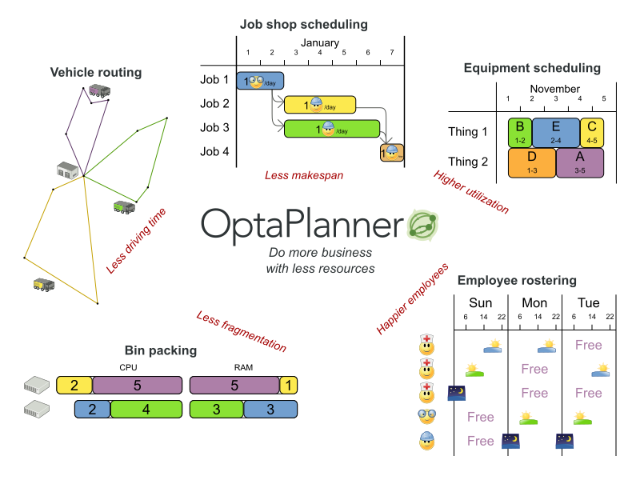

[id='optimizer-about-optimizer-con']
= What is {PLANNER}

{PLANNER} is a lightweight, embeddable planning engine that optimizes planning problems.
It helps normal Java(TM) programmers solve planning problems efficiently, and it combines optimization heuristics and metaheuristics with very efficient score calculations.

{PLANNER} helps solve various use cases like the following:

* _Employee/Patient Rosters_. It helps create timetables for nurses and keeps track of patient bed management.
* _Educational Timetables_. It helps schedule lessons, courses, exams, and conference presentations.
* _Shop Schedules_: It tracks car assembly lines, machine queue planning, and workforce task planning.
* _Cutting Stock_: It minimizes waste by reducing the consumption of resources such as paper and steel.

Every organization faces planning problems; that is, they provide products and services with a limited set of constrained resources (employees, assets, time, and money).

.Use Case Overview

{PLANNER} is open source software under the Apache Software License 2.0.
It is 100% pure Java(TM) and runs on any Java virtual machine.
