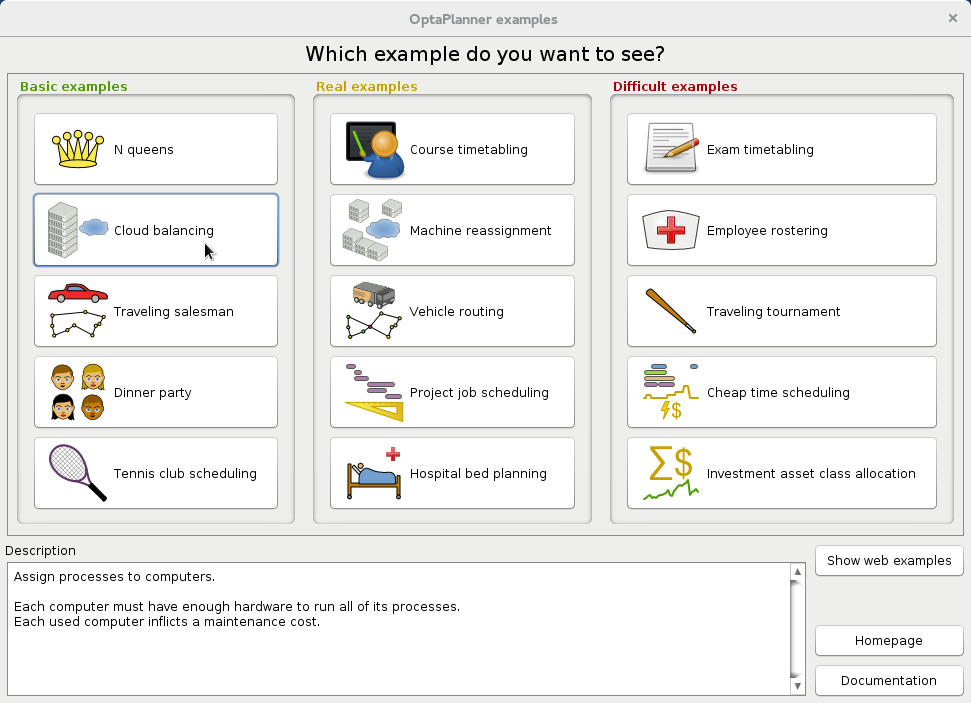

[id='optimizer-running-the-examples-proc']
= Running the Business Optimizer examples

{PLANNER} ships with a number of examples to demonstrate a variety of use cases.

.Prerequisite
Download and install {PRODUCT} from the https://access.redhat.com[Red Hat Customer Portal]. 

.Procedure
. Download the {PLANNER} file from the https://access.redhat.com[Red Hat Customer Portal].
. Unzip the {PLANNER} files.
. Open the directory `examples` and run the following script:
+
Linux or Mac:
+

[source]
----
$ cd examples
$ ./runExamples.sh
----
+
Windows:
+

[source]
----
$ cd examples
$ runExamples.bat
----

Select and run an example from the GUI application window:

[NOTE]
====
{PLANNER} itself has no GUI dependencies.
It runs just as well on a server or a mobile JVM as it does on the desktop.
====

include::optimizer-running-the-examples-in-an-IDE-proc.adoc[leveloffset=+1]

