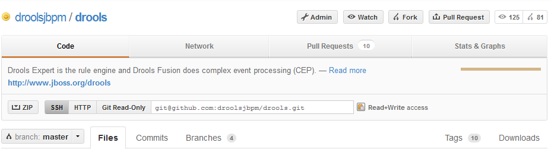

[[_gettingstarted]]
= Getting Involved

We are often asked "How do I get involved". Luckily the answer is simple, just write some code and submit it :) There are no hoops you have to jump through or secret handshakes.
We have a very minimal "overhead" that we do request to allow for scalable project development.
Below we provide a general overview of the tools and "workflow" we request, along with some general advice.

If you contribute some good work, don't forget to blog about it :)

== Sign up to jboss.org

Signing to jboss.org will give you access to the JBoss wiki, forums and JIRA.
Go to https://www.jboss.org/ and click "Register".

image::GettingInvolved/sign_jbossorg.png[]

== Sign the Contributor Agreement

The only form you need to sign is the contributor agreement, which is fully automated via the web.
As the image below says "This establishes the terms and conditions for your contributions and ensures that source code can be licensed appropriately"

https://cla.jboss.org/

image::GettingInvolved/sign_contributor.png[]

== Submitting issues via JIRA

To be able to interact with the core development team you will need to use JIRA, the issue tracker.
This ensures that all requests are logged and allocated to a release schedule and all discussions captured in one place.
Bug reports, bug fixes, feature requests and feature submissions should all go here.
General questions should be undertaken at the mailing lists.

Minor code submissions, like format or documentation fixes do not need an associated JIRA issue created.

https://issues.jboss.org/browse/DROOLS

https://issues.jboss.org/browse/JBPM

image::GettingInvolved/submit_jira.png[]

== Fork GitHub

With the contributor agreement signed and your requests submitted to JIRA you should now be ready to code :) Create a GitHub account and fork any of the Drools, jBPM or Guvnor repositories.
The fork will create a copy in your own GitHub space which you can work on at your own pace.
If you make a mistake, don't worry blow it away and fork again.
Note each GitHub repository provides you the clone (checkout) URL, GitHub will provide you URLs specific to your fork.

https://github.com/kiegroup

== Writing Tests

When writing tests, try and keep them minimal and self contained.
We prefer to keep the DRL fragments within the test, as it makes for quicker reviewing.
If their are a large number of rules then using a String is not practical so then by all means place them in separate DRL files instead to be loaded from the classpath.
If your tests need to use a model, please try to use those that already exist for other unit tests; such as Person, Cheese or Order.
If no classes exist that have the fields you need, try and update fields of existing classes before adding a new class.

There are a vast number of tests to look over to get an idea, MiscTest is a good place to start.

https://github.com/kiegroup[https://github.com/kiegroup/drools/blob/master/drools-compiler/src/test/java/org/drools/integrationtests/MiscTest.java]

image::GettingInvolved/unit_test.png[]

== Commit with Correct Conventions

When you commit, make sure you use the correct conventions.
The commit must start with the JIRA issue id, such as DROOLS-1946.
This ensures the commits are cross referenced via JIRA, so we can see all commits for a given issue in the same place.
After the id the title of the issue should come next.
Then use a newline, indented with a dash, to provide additional information related to this commit.
Use an additional new line and dash for each separate point you wish to make.
You may add additional JIRA cross references to the same commit, if it's appropriate.
In general try to avoid combining unrelated issues in the same commit.

Don't forget to rebase your local fork from the original master and then push your commits back to your fork.

image::GettingInvolved/jira_crossreferenced.png[]

== Submit Pull Requests

With your code rebased from original master and pushed to your personal GitHub area, you can now submit your work as a pull request.
If you look at the top of the page in GitHub for your work area their will be a "Pull Request" button.
Selecting this will then provide a gui to automate the submission of your pull request.

The pull request then goes into a queue for everyone to see and comment on.
Below you can see a typical pull request.
The pull requests allow for discussions and it shows all associated commits and the diffs for each commit.
The discussions typically involve code reviews which provide helpful suggestions for improvements, and allows for us to leave inline comments on specific parts of the code.
Don't be disheartened if we don't merge straight away, it can often take several revisions before we accept a pull request.
Luckily GitHub makes it very trivial to go back to your code, do some more commits and then update your pull request to your latest and greatest.

It can take time for us to get round to responding to pull requests, so please be patient.
Submitted tests that come with a fix will generally be applied quite quickly, where as just tests will often way until we get time to also submit that with a fix.
Don't forget to rebase and resubmit your request from time to time, otherwise over time it will have merge conflicts and core developers will general ignore those.

image::GettingInvolved/submit_pull_request.png[]
